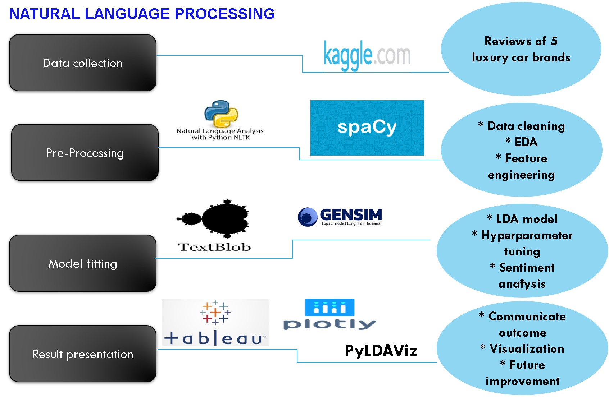

# Introduction #

Natural Language Processing is a Machine Learning method used to teach computers how to understand natural human language. It is not an easy task to teach these languages to a computer, but with the help of **NLP** process it's possible for the computer to read, decipher, understand, and make sense of the human languages in a manner that is valuable. 

In machine learning and natural language processing, a **topic model** is a statistical model used for discovering the abstract "topics" that occur in a collection of documents or in a corpus. A topic is a collection of dominant keywords that express the general meaning of the text.

NLP could be used to extract topics from reviews, social media feeds, comments, articles, emails as well as user feedbacks. Understanding what customers are talking about in a particular product is very vital to companies especially e-commerce industry. However, since these online reviews are quite often overwhelming in terms of numbers and information, an intelligent system, capable of finding key insights (topics) from these reviews, will be of great help for both customers and companies. The goal of my project is to help customers make a decision when buying luxury cars and help these car brands to understand what their customers are saying and make some improvements on their products. 
I got a lot of inspiration from [this article](https://www.machinelearningplus.com/nlp/topic-modeling-gensim-python/) and [this article](https://www.analyticsvidhya.com/blog/2018/10/mining-online-reviews-topic-modeling-lda/) by PRATEEK JOSHI

I also learn from [Alice Zhao's](https://github.com/adashofdata/nlp-in-python-tutorial) project on Topic modeling and Sentiment Analysis

One of the most effective ways of doing topic modeling is by using Gensim LDA model. In this project we will be using the following 2 versions of gensim LDA model to see which one is the fastest computationally, provides meaningful topics and has the best coherence score:
*  **LDAMulticore**
*  **LDAMallet**

# Project objective #
  **Abstract**

There has been a rapid growth in sales of luxury cars over the last decade especially in North America. According to [Driving.ca's](https://driving.ca/audi/q5/features/feature-story/canadas-10-best-selling-luxury-vehicles-in-2019s-first-half) article, automobile sales generated by premium brands are taking a hit in 2019. So I wanted to understand what are the qualities that are most important to buyers through the customer reviews.

My project will be using **NLP and Latent Dirichlet Allocation (LDA) for topic modeling and sentiment analysis of the reviews of 5 luxury car brands**

*  **With the customer reviews, I want to use NLP and LDA to understand what are the qualities that are important to buyers.** 
*  **I will also investigate the sentiment in the reviews**
You can find the codes of these two questions in the Python code Folder

# Tools and Libraries used #
NLTK (Words tokenizer, stopwords and WordNetLemmatizer)
* Spacy
* Seaborn and Matplotlib
* Gensim libraries for Topic modeling
* TextBlob (sentiment analysis library)
* Pickle
* WordCloud
* Plotly
* Numpy and Pandas
* PyLDAViz
## Dataset ##

    Source:
    
 The data was downloaded from [kaggle](kaggle.com). It was originally scrapped from [Edmund](Edmund.com), an American auto review website.
        
    Data content:
    
*  **5 luxurious car brands (Audi, Mercedes, BMW, Infiniti and Lexus)**

*  **contain 41520 rows**

*  **7 columns**
# Project Process #
* I got the datasets from this [link](https://www.kaggle.com/ankkur13/edmundsconsumer-car-ratings-and-reviews). You can find the merged dataset on *CSV FILES* on my GitHub page
   * load and merge the 5 dataset in one dataframe
   * check the data info, type, shape and null values
* Pre-processing
   * Remove null-values i.e rows with no reviews
   * Drop some unwanted columns
   * Do some feature engineering
   * Change the data type of some of the columns like date column
   * Remove stop-words with NLTK
   * Remove number from text with regular expression function
   * Lower the text and remove words lower than 3 letters
   * Bring the text back to it's base via lemmatization with Spacy
* EDA
    * Do some visualization, e.g wordcloud to uderstand the common words in the review
* LDA Model fitting for topic modeling 
   * Create a dictionatry and a corpus with the review text (the 2 are needed for the LDA models) 
   * Try out the 2 LDA models (LDAMulticore and LDAMallet) to see the one with the highest coherence score and with meaningful topics from the text
*  Sentiment Analysis
   * Do some feature engineering to get the sentiment in the reviews
   * Used TextBlob to derive the polarity and subjectivity in the reviews
* Visualization
   * Plot the the topics PyLDAviz
   * Use both plotly and Tableau to visualize the result of the sentiments
*  Communicate insights
   * Conclusion
   * Future work to improve the project 
